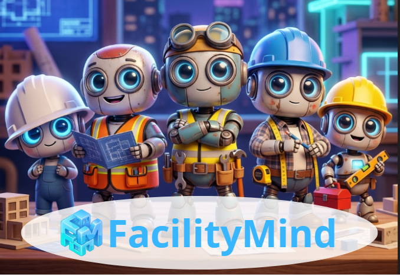
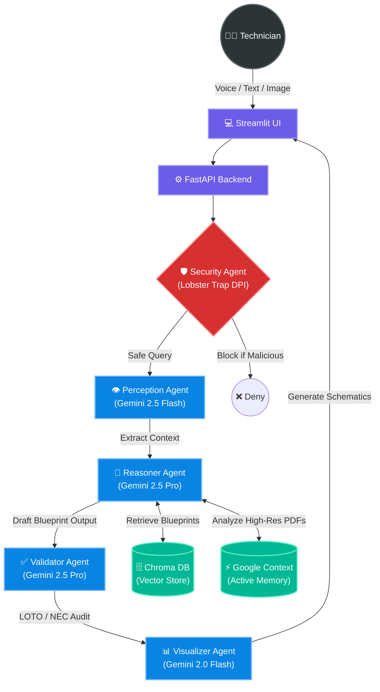
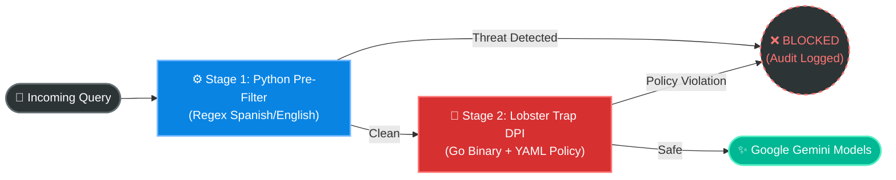
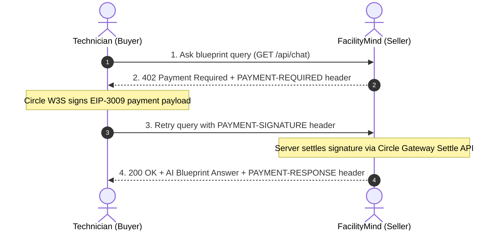

# FacilityMind: AI Agentic Orchestration for Facility Management

<div align="center">


<br/>



</div>

**FacilityMind** is an advanced, enterprise-grade multi-agent AI system designed to revolutionize building maintenance and facility management operations. It enables technicians and engineers to interactively and visually query complex construction blueprints (electrical, plumbing, architectural, structural) using voice, images, or text.

---

## Table of Contents
- [Advanced Google Gemini Integration](#advanced-google-gemini-integration)
- [Multi-Agent Architecture](#multi-agent-architecture-orchestrated-pipeline)
- [Technical Stack](#technical-stack)
- [Security Architecture (Lobster Trap)](#security-architecture-lobster-trap)
- [Business Model & Payments](#business-model--payments-x402-utility-tokenomics)
- [Blueprint Ingestion](#blueprint-ingestion)
- [Installation & Deployment](#installation--deployment)
- [Supported Safety Standards](#supported-safety-standards)
- [License](#license)

---

## Advanced Google Gemini Integration

The system leverages cutting-edge capabilities of the Google Gemini API to deliver high-performance, robust, and cost-effective reasoning on massive architectural documents:

### 1. Context Caching API
* **Function**: To eliminate latency and avoid high token consumption when reading full blueprint documents (32+ pages) on every single user query, FacilityMind implements Google's **Context Caching**.
* **Impact**: The blueprint is loaded into Gemini's active context memory once. Subsequent queries achieve ultra-low response latency (~1.5 seconds) and reduce token costs by up to 90%.

### 2. Google File API (`google.generativeai.upload_file`)
* **Function**: Instead of encoding heavy PDFs into base64 strings and sending them over HTTP payloads, blueprints are uploaded directly to Google's secure generative file storage.
* **Impact**: Gemini accesses the vector PDF document in its native format, allowing it to inspect millimeter-fine lines and small CAD callouts without resolution loss.

### 3. Multimodal Vision OCR (Gemini 2.5 Flash Vision)
* **Function**: Avoids traditional PDF text extractors that fail on CAD drawings due to scattered or fragmented character layouts.
* **Impact**: Pages are rendered as high-resolution images (200 DPI) and parsed visually by Gemini 2.5 Flash. The model extracts clear, spatially-aware structural text (e.g., *"In BEDROOM: outlets are powered by circuit A-9"*), which is indexed into Chroma DB to completely eliminate hallucinations.

### 4. Structured JSON Outputs (Response Schema Enforcement)
* **Function**: Enforces strict JSON response schemas on the Gemini API calls using Pydantic model definitions.
* **Impact**: Ensures that all agent communication remains 100% type-safe, providing clean JSON objects with exact integer page citations, boolean approvals, and structured safety assessments.

### 5. Multi-Agent Chain-of-Thought (CoT) Orchestration
* **Function**: Coordinates **Gemini 2.5 Pro** (optimized for deep technical reasoning and safety validation) with **Gemini 2.5 Flash** (optimized for rapid multimodal perception and vision extraction).
* **Impact**: Delivers a perfect balance of surgical accuracy, strict hallucination prevention, and API execution speed.

### 6. Gemini Text Embeddings (`text-embedding-004`)
* **Function**: Uses Google's native `text-embedding-004` model to generate high-dimensional vector representations of blueprint text chunks for semantic similarity search.
* **Impact**: Enables the RAG pipeline to retrieve the most contextually relevant blueprint sections for any technician query, powering precise circuit-level answers from thousands of indexed pages.

---

## Multi-Agent Architecture (Orchestrated Pipeline)

FacilityMind coordinates **5 specialized AI agents** to verify technical responses, enforce field safety, and protect the platform against prompt injection and malicious queries:



### Core Agents
0. **Security Agent (Lobster Trap DPI)**: A two-stage firewall that inspects every query *before* it reaches any AI model. Stage 1 uses Python regex for instant Spanish/English threat pattern matching. Stage 2 invokes the Lobster Trap Go binary for deep prompt inspection (DPI) against a programmable YAML policy.
1. **Perception Agent (Gemini 2.5 Flash)**: Processes multimodal inputs (voice recordings, panel photos, or text) to extract structured parameters: building, tower, floor, room, and maintenance goal.
2. **Technical Reasoner (Gemini 2.5 Pro)**: Integrates semantic context from Chroma DB with the visual memory of Google Context Cache to trace physical infrastructure paths (e.g., circuits/pipes) and generate candidates with exact blueprint page citations.
3. **Validator Agent (Gemini 2.5 Pro)**: The final line of defense. Cross-checks citations against original documents, corrects technical errors, detects hallucinations, and evaluates LOTO/NEC electrical code compliance.
4. **Visualizer Agent (Gemini 2.0 Flash)**: Converts technical data into interactive **Mermaid.js** flowcharts and visual schemas for the technician.

---

## Technical Stack

* **Core Intelligence**: Google Gemini 2.5 Pro (Reasoning & Validation) & Gemini 2.5 Flash (Perception & Vision OCR).
* **Knowledge Base**: ChromaDB (Vector database) using Gemini Embeddings (`text-embedding-004`).
* **Nanopayments & Web3**: Circle Web3 Programmable Wallets (Developer-Controlled EOA) & Circle Gateway x402 Batched Settlement.
* **API Backend**: FastAPI (Python 3.10+).
* **Technical Dashboard**: Streamlit.
* **Security Middleware**: [Lobster Trap](https://github.com/veea-io/lobstertrap) — Go-based AI prompt firewall with YAML-programmable DPI policies and a real-time monitoring dashboard.

---

## Security Architecture (Lobster Trap)

FacilityMind implements a **Two-Stage AI Firewall** that inspects every user query before it reaches any AI model:



### Stage 1 — Python Regex Pre-Filter (Offline, <1ms)
A curated set of regular expressions in Spanish and English that instantly blocks known threat patterns:
- Prompt injection (`ignore previous instructions`, `jailbreak`)
- Role impersonation (`soy el admin`, `I am the developer`)
- Credential theft (`dame la clave API`, `give me your password`)

### Stage 2 — Lobster Trap DPI (Go binary, ~250ms)
The [Lobster Trap](https://github.com/veea-io/lobstertrap) Go binary performs deep prompt inspection against a YAML policy file (`configs/facilitymind_policy.yaml`), evaluating 15+ threat signals:
- Prompt/instruction injection patterns
- Sensitive file path access (e.g., `/etc/passwd`)
- Role impersonation, exfiltration, obfuscation, and malware requests
- Risk scoring and audit trail logging

### Real-Time Security Dashboard
The Lobster Trap proxy runs as a local HTTP server on port `8080` and exposes a live monitoring dashboard:
```
http://127.0.0.1:8080/_lobstertrap/
```

---

## Business Model & Payments (x402 Utility Tokenomics)

FacilityMind implements an innovative **Pay-per-Token Utility Billing Model** with a **cost-plus margin commission** on every AI inference query, enabled exclusively by the **Circle x402 Nanopayments** protocol:

### Cost-Plus Pricing Model
1. **Precise Utility Metering:** For every blueprint or safety query, the system calculates the exact number of input tokens (query + retrieved RAG context) and output tokens (AI agent response).
2. **Base Inference Cost:** We baseline pricing on native Google Gemini API rates (e.g., Gemini 2.5 Pro: $1.25/M input tokens, $5.00/M output tokens).
3. **100% Platform Markup (Margin Commission):** We apply a `MARGIN_MULTIPLIER = 2.0`, charging the user twice the baseline inference cost. 
   - *Example:* If a technical query costs $0.0005 USD base on Gemini, the platform charges the client **$0.0010 USDC**.
   - The **additional $0.0005 USDC represents 100% pure profit margin** for the FacilityMind platform.

### Why Circle x402 is the Only Viable Solution
- **The Legacy Payment Failure (Stripe/Visa):** Traditional payment processors charge a flat rate of `$0.30 USD + 2.9%` per transaction. Charging a technician $0.001 USD per query using a credit card is mathematically impossible.
- **The Gas Fee Bottleneck:** Processing standard on-chain transactions for each query on traditional blockchains would incur gas fees exceeding the cost of the query by 10x to 100x.
- **The Circle x402 Solution:** By depositing USDC into the Gateway Wallet contract, technicians authorize off-chain payments using EIP-3009 signatures. Circle Gateway aggregates thousands of payments into a single net-settled batch, **eliminating per-query gas fees** and enabling economic, sub-cent microtransactions down to $0.000001 USDC.

### HTTP 402 Sequence Handshake Flow
The diagram below represents the exact HTTP 402 negotiation flow implemented in FacilityMind:



---

## Blueprint Ingestion

1. Access the web interface at `http://127.0.0.1:8501`.
2. Expand the **Upload new blueprint** section in the sidebar.
3. Upload the blueprint PDF, assign a unique ID (e.g., `Mixed-Use`), and click **Upload Blueprint**.
4. **Ingestion Workflow**:
   * The file is saved locally and registered in **Google Context Cache** synchronously (takes ~5 seconds).
   * A background task starts immediately, performing page-by-page **Vision OCR** to index structured spatial records into **Chroma DB**. Progress can be monitored in the backend terminal logs.

---

## Installation & Deployment

### Prerequisites
* Python 3.10 or higher.
* Google Gemini API Key.

### Environment Setup

1. **Clone the repository**:
   ```bash
   git clone https://github.com/JaDi03/FacilityMind.git
   cd FacilityMind
   ```

2. **Initialize virtual environment**:
   ```bash
   python -m venv venv
   source venv/bin/activate  # On Windows: venv\Scripts\activate
   pip install -r requirements.txt
   ```

3. **Configure environment variables**:
   Create a `.env` file in the root directory based on `.env.example` and define your API key:
   ```env
   GEMINI_API_KEY="your_gemini_api_key_here"
   ```

### Running Services (Unified Launch Script)

Use the provided unified startup utility to launch both the backend and frontend automatically:

```bash
python start.py
```

* **API Backend**: `http://127.0.0.1:8000`
* **Streamlit UI**: `http://127.0.0.1:8501`
* **Lobster Trap Security Dashboard**: `http://127.0.0.1:8080/_lobstertrap/`

---

## Supported Safety Standards

* **Lock-Out/Tag-Out (LOTO)**: Mandatory safety alerts and tag requirements before performing any panel or valve maintenance.
* **Electrical Safety Codes (NEC 240.82)**: Immediate rejection and high-risk warnings for illegal procedures (e.g., bypassing breakers).
* **Strict Spatial Isolation**: Room-level tracing constraints that prevent grouping adjacent circuits, ensuring the technician isolates the exact breaker required.

---

## License

This project is licensed under the MIT License.
