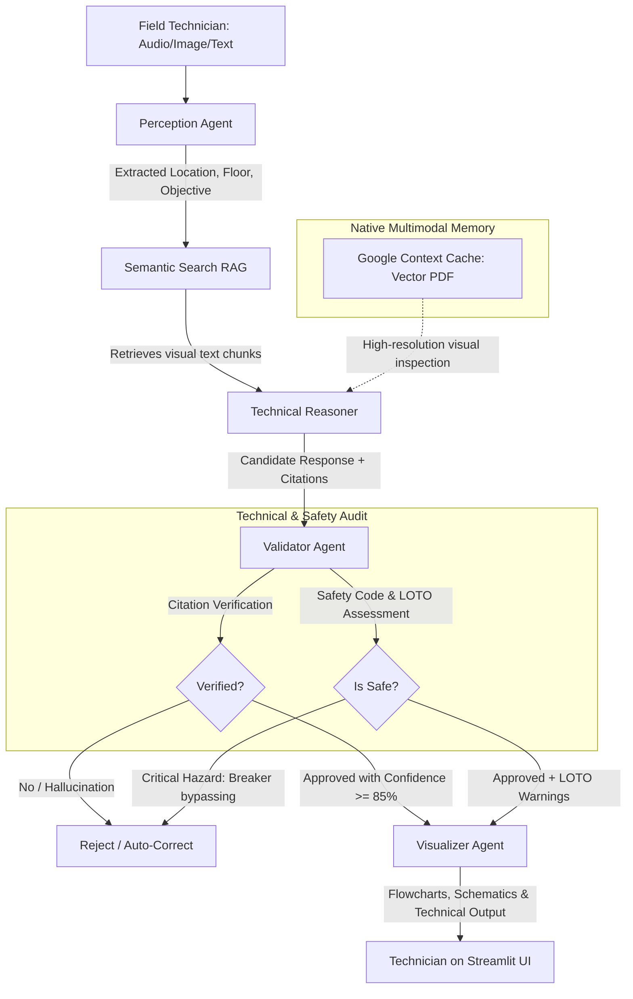

# 🏗️ FacilityMind: AI Agentic Orchestration for Facility Management

<div align="center">


</div>

**FacilityMind** is an advanced, enterprise-grade multi-agent AI system designed to revolutionize building maintenance and facility management operations. It enables technicians and engineers to interactively and visually query complex construction blueprints (electrical, plumbing, architectural, structural) using voice, images, or text.

---

## 🚀 Advanced Google Gemini Integration

The system leverages cutting-edge capabilities of the Google Gemini API to deliver high-performance, robust, and cost-effective reasoning on massive architectural documents:

### ⚡ 1. Context Caching API
* **Function**: To eliminate latency and avoid high token consumption when reading full blueprint documents (32+ pages) on every single user query, FacilityMind implements Google's **Context Caching**.
* **Impact**: The blueprint is loaded into Gemini's active context memory once. Subsequent queries achieve ultra-low response latency (~1.5 seconds) and reduce token costs by up to 90%.

### 📁 2. Google File API (`google.generativeai.upload_file`)
* **Function**: Instead of encoding heavy PDFs into base64 strings and sending them over HTTP payloads, blueprints are uploaded directly to Google's secure generative file storage.
* **Impact**: Gemini accesses the vector PDF document in its native format, allowing it to inspect millimeter-fine lines and small CAD callouts without resolution loss.

### 👁️ 3. Multimodal Vision OCR (Gemini 2.5 Flash Vision)
* **Function**: Avoids traditional PDF text extractors that fail on CAD drawings due to scattered or fragmented character layouts.
* **Impact**: Pages are rendered as high-resolution images (200 DPI) and parsed visually by Gemini 2.5 Flash. The model extracts clear, spatially-aware structural text (e.g., *"In BEDROOM: outlets are powered by circuit A-9"*), which is indexed into Chroma DB to completely eliminate hallucinations.

### 📐 4. Structured JSON Outputs (Response Schema Enforcement)
* **Function**: Enforces strict JSON response schemas on the Gemini API calls using Pydantic model definitions.
* **Impact**: Ensures that all agent communication remains 100% type-safe, providing clean JSON objects with exact integer page citations, boolean approvals, and structured safety assessments.

### 🤖 5. Multi-Agent Chain-of-Thought (CoT) Orchestration
* **Function**: Coordinates **Gemini 2.5 Pro** (optimized for deep technical reasoning and safety validation) with **Gemini 2.5 Flash** (optimized for rapid multimodal perception and vision extraction).
* **Impact**: Delivers a perfect balance of surgical accuracy, strict hallucination prevention, and API execution speed.

---

## 🛠️ Multi-Agent Architecture (Orchestrated Pipeline)

FacilityMind coordinates **4 specialized AI agents** to verify technical responses and enforce field safety:



### Core Agents:
1. **Perception Agent (Gemini 2.5 Flash)**: Processes multimodal inputs (voice recordings, panel photos, or text) to extract structured parameters: building, tower, floor, room, and maintenance goal.
2. **Technical Reasoner (Gemini 2.5 Pro)**: Integrates semantic context from Chroma DB with the visual memory of Google Context Cache to trace physical infrastructure paths (e.g., circuits/pipes) and generate candidates with exact blueprint page citations.
3. **Validator Agent (Gemini 2.5 Pro)**: The final line of defense. Cross-checks citations against original documents, corrects technical errors, detects hallucinations, and evaluates LOTO/NEC electrical code compliance.
4. **Visualizer Agent (Gemini 2.0 Flash)**: Converts technical data into interactive **Mermaid.js** flowcharts and visual schemas for the technician.

---

## ⚡ Technical Stack

* **Core Intelligence**: Google Gemini 2.5 Pro (Reasoning & Validation) & Gemini 2.5 Flash (Perception & Vision OCR).
* **Knowledge Base**: ChromaDB (Vector database) using Gemini Embeddings (`text-embedding-004`).
* **API Backend**: FastAPI (Python 3.10+).
* **Technical Dashboard**: Streamlit.

---

## 🚀 Installation & Deployment

### Prerequisites
* Python 3.10 or higher.
* Google Gemini API Key.

### Environment Setup

1. **Clone the repository**:
   ```bash
   git clone https://github.com/JaDi03/FacilityMind.git
   cd FacilityMind
   ```

2. **Initialize virtual environment**:
   ```bash
   python -m venv venv
   source venv/bin/activate  # On Windows: venv\Scripts\activate
   pip install -r requirements.txt
   ```

3. **Configure environment variables**:
   Create a `.env` file in the root directory based on `.env.example` and define your API key:
   ```env
   GEMINI_API_KEY="your_gemini_api_key_here"
   ```

### Running Services (Unified Launch Script)

Use the provided unified startup utility to launch both the backend and frontend automatically:

```bash
python start.py
```

* **API Backend**: `http://127.0.0.1:8000`
* **Streamlit UI**: `http://127.0.0.1:8501`

---

## 🏗️ Blueprint Ingestion

1. Access the web interface at `http://127.0.0.1:8501`.
2. Expand the **Upload new blueprint** section in the sidebar.
3. Upload the blueprint PDF, assign a unique ID (e.g., `Mixed-Use`), and click **Upload Blueprint**.
4. **Ingestion Workflow**:
   * The file is saved locally and registered in **Google Context Cache** synchronously (takes ~5 seconds).
   * A background task starts immediately, performing page-by-page **Vision OCR** to index structured spatial records into **Chroma DB**. Progress can be monitored in the backend terminal logs.

---

## 🔒 Supported Safety Standards

* **Lock-Out/Tag-Out (LOTO)**: Mandatory safety alerts and tag requirements before performing any panel or valve maintenance.
* **Electrical Safety Codes (NEC 240.82)**: Immediate rejection and high-risk warnings for illegal procedures (e.g., bypassing breakers).
* **Strict Spatial Isolation**: Room-level tracing constraints that prevent grouping adjacent circuits, ensuring the technician isolates the exact breaker required.

---

## 📄 License

This project is licensed under the MIT License.
